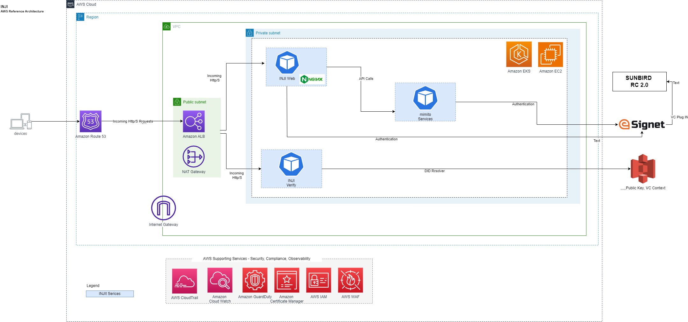

# INJI, one-click deployment on AWS

### Description
Inji provides a comprehensive solution for managing verifiable credentials across their entire lifecycle. It offers a suite of tools for Create, Issue, Manage, Share, Verify and Consume Credentials.
 To learn more about INJI, please visit [INJI](https://docs.mosip.io/inji).

### Packaging overview
This packaging initiative offers a practical approach to increase the adoption, streamline deployment and management of INJI building blocks on AWS by providing a reference architecture and one-click deployment automation scripts. It allows builders to manage AWS resource provisioning and application deployment in a programmatic and repeatable way.

This repository contains the source code and configuration for deploying INJI stack that leverages the power of Amazon Web Services (AWS) **[Cloud Development Kit (CDK)](https://aws.amazon.com/cdk)** for infrastructure provisioning and **[Helm](https://helm.sh)** for deploying services within an Amazon Elastic Kubernetes Service (EKS) cluster.  

**Ensure you have already installed and setup the eSignet and Sunbird RC services to proceed for INJI deployment. If you dont have it installed, please visit this [link](https://github.com/dpgonaws/inji-certify-aws-automation/) to install and setup the esignet and Sunbird RC services.**

### INJI Deployment
The INJI one-click deployment packaging offers two mode of deployments on the AWS cloud, catering to different deployment scenarios.

#### Mode One: AWS CDK + Helm
This mode offers a comprehensive solution for users who prefer a one-click deployment approach to provisioning AWS infrastructure and deploying the INJI application stack.

* [AWS CDK One Click Deployment](documentation/01-Deployment-CDK-INJI.md)

#### Mode Two: Direct Helm Chart Invocation
An alternative deployment approach accommodates users with existing essential AWS infrastructure components like Amazon RDS Postgres and an Amazon EKS cluster. This mode enables the direct installation of the INJI Helm chart without relying on AWS CDK scripts. Alternatively, you can combine both methods, utilizing CDK for provisioning specific services like the EKS cluster.

* [Helm Chart Deployment](documentation/02-Deployment-Helm-INJI.md)

### INJI reference architecture
Required AWS services to operate the core INJI registry services:
* Amazon VPC
* Amazon Elastic Kubernetes Service (Amazon EKS)
* Amazon Application Loadbalancer (ALB)

